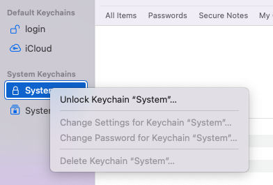
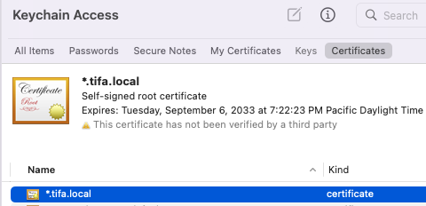
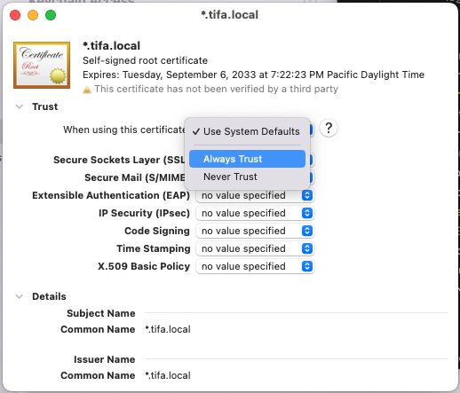

# Trust SSL Certificates

Go to Keychain Access.

```sh
open -a "Keychain Access"
```

Right click on `System` to `Unlock Keychain "System"`.



Drag and drop the certificate into the `Certificates` window.



Double click on the certificate and expand the `Trust` heading. Select `Always Trust` for everything.



⌘ + W to save.
